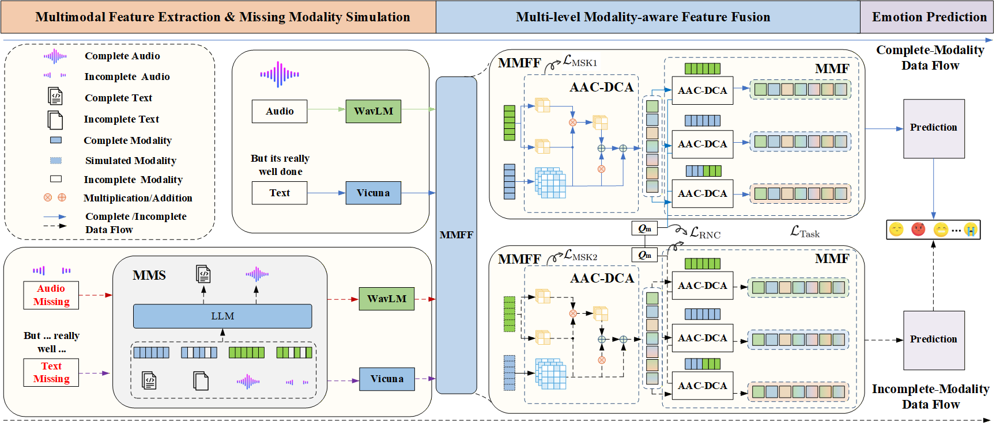

# LLM-Assisted Audio--Text Emotion Recognition with Multi-level Modality-aware Feature Fusion under Complete and Missing Modalities

<div style="text-align: center;">
    <a href='https://arxiv.org/abs/2410.15029'>
        
    </a>
</div>

[ICASSP 2025] Enhancing Multimodal Sentiment Analysis for Missing Modality through Self-Distillation and Unified Modality Cross-Attention

Authors: Yuzhe Weng, Haotian Wang, Tian Gao, Kewei Li, Shutong Niu, Jun Du


## 🔥 News

- :fire:(Mar 24, 2025) The representations used for training have been open sourced! 
- (Oct 19, 2024) The final model weights are shared on Google Drive!
- The project page is uploaded on the Github!


## :star: Overview 

The overall architecture:

<div align="center">

</div>

In multimodal sentiment analysis, collecting text data is often more challenging than video or audio. To address this challenge, our study has developed a robust model that effectively integrates multimodal sentiment information, even in the absence of text modality. Specifically, we have developed a Double-Flow Self-Distillation Framework, including Unified Modality Cross-Attention (UMCA) and Modality Imagination Autoencoder (MIA), which excels at processing both scenarios with complete modalities and those with missing text modality. When the text modality is missing, our framework uses the LLM-based model to simulate the text representation from the audio modality. To further align the simulated and real representations, we have also introduced the Rank-N Contrast (RNC) loss function. When testing on the CMU-MOSEI, our model achieved outstanding performance on MAE and significantly outperformed other models when text modality is missing.


## 🚀 Weights & Representation

| Model | Complete Modality MSE | Text Modality Missing MSE | File Size | Link                                                         |
| :---- | --------------------- | ------------------------- | --------- | ------------------------------------------------------------ |
| ULLM | 0.5060                | 0.5503                    | 49MB      | [[Google Drive]](https://drive.google.com/file/d/1qDM47_lG0B2eXKVJ8nrx7iOFrd-bD9hC/view?usp=sharing) |


Representation:
[Baidu Drive](https://pan.baidu.com/s/1iHbWPZps-uidqRflAnKnFw?pwd=cqdb)
```
https://pan.baidu.com/s/1iHbWPZps-uidqRflAnKnFw?pwd=cqdb -> 
features_mosei/manet_FRA 
features_mosei/vicuna-7b-v1.5-FRA-wavlm2vicuna-half-gt
features_mosei/vicuna-7b-v1.5-FRA-wavlm2vicuna-half-wav+prompt[take_generate_wordembed_-4]
features_mosei/wavlm-large-FRA_-5
```

Dataset Labels
[[Google Drive]](https://drive.google.com/file/d/1-k9A9kFnIlk94QY6nMbc2r3pTu6btU3p/view?usp=sharing)
```
label_official.npz -> dataset/datasets_label/cmumosei-process/
```

## 🔧 Usage

### Requirements

Python >= 3.9

Pytorch >= 1.8.0

```
pip install -r requirements.txt
```


### Inference & Evaluation

If you wish to run inference to evaluate the model's performance, please download the model weights and modality representations into their respective directories. The directory structure should be as follows:

```

├── checkpoints
│   └── mosei_mult-view_kd_full_0.5060_0.5503.pt
└── dataset
    ├── datasets_label
    │   └── cmumosei-process
	│		└── label_official.npz
    └── features_mosei
        ├── manet_FRA
        ├── vicuna-7b-v1.5-FRA-wavlm2vicuna-half-gt
        ├── vicuna-7b-v1.5-FRA-wavlm2vicuna-half-wav+prompt[take_generate_wordembed_-4]
        └── wavlm-large-FRA_-5
```

Run the script to view inference results: 

```shell
bash ./shell/main_text_missing_icassp_inference.sh
```


### Training

#### Training with extracted representations

If you want to directly use the representations we have extracted for you to train the model, you can download the representations directly from the README link and run the following script directly:

```shell
bash ./shell/main_text_missing_icassp.sh
```

#### Training with representations extracted by yourself

If you want to extract representations yourself for related experiments, you can refer to the following configuration.

**Build ./tools folder**

```
## for face extractor (OpenFace-win)
https://drive.google.com/file/d/1-O8epcTDYCrRUU_mtXgjrS3OWA4HTp0-/view?usp=share_link  -> tools/openface_win_x64
## for visual feature extraction
https://drive.google.com/file/d/1wT2h5sz22SaEL4YTBwTIB3WoL4HUvg5B/view?usp=share_link ->  tools/manet

## for audio extraction
https://www.johnvansickle.com/ffmpeg/old-releases ->  tools/ffmpeg-4.4.1-i686-static
## for acoustic features
https://huggingface.co/microsoft/wavlm-large -> tools/transformers/wavlm-large

## for text features
https://huggingface.co/lmsys/vicuna-7b-v1.5 ->  tools/transformers/vicuna-7b-v1.5

## for simulated text representation
# details: https://github.com/X-LANCE/SLAM-LLM/blob/main/examples/asr_librispeech/README.md
https://drive.google.com/file/d/1cLNuMR05oXxKj8M_Z3yAZ5JHJ06ybIHp/view?usp=sharing  ->  tools/transformers/WalmL2VicunaV1.5_model.pt
```

You can refer to the run.sh file in each directory of `./features_extraction` to extract each representation.


## :computer: Results

This work ablates various designs of the model and demonstrates the effectiveness of each design.

<div align="center">

</div>


Compared with recent models that have performed well on this task, our model achieves optimal performance in both complete and missing modes.

<div align="center">

</div>


## 🌠 Acknowledgements

Thanks to open source repository [MERTools](https://github.com/zeroQiaoba/MERTools), we have done a lot of work based on it.


## :newspaper:Citation

If you find our work useful in your research, please consider citing: 

```
@inproceedings{weng2025enhancing,
  title={Enhancing Multimodal Sentiment Analysis for Missing Modality through Self-Distillation and Unified Modality Cross-Attention},
  author={Weng, Yuzhe and Wang, Haotian and Gao, Tian and Li, Kewei and Niu, Shutong and Du, Jun},
  booktitle={ICASSP 2025-2025 IEEE International Conference on Acoustics, Speech and Signal Processing (ICASSP)},
  pages={1--5},
  year={2025},
  organization={IEEE}
}
```
